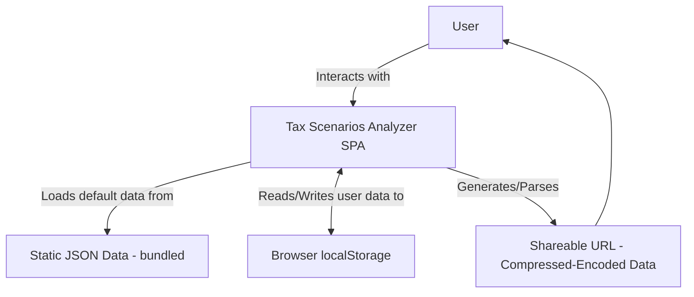
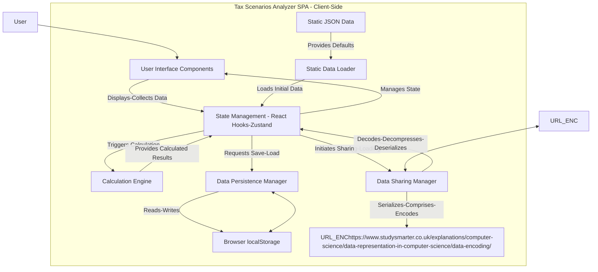

# Tax Scenarios Analyzer MVP Architecture Document

## Introduction / Preamble

This document outlines the overall project architecture for the "Tax Scenarios Analyzer MVP," focusing exclusively on its client-side implementation. As a single-page application (SPA) designed to run entirely within the user's browser, there are no traditional backend systems, shared services, or database concerns in this MVP.

Its primary goal is to serve as the guiding architectural blueprint for AI-driven development and subsequent implementation, ensuring consistency and adherence to chosen patterns and technologies within the client-side environment. This document will detail the structure, data flow, calculation logic, and persistence mechanisms that enable the application's functionality.

**Relationship to Frontend Architecture:**
Given that the "Tax Scenarios Analyzer MVP" is a client-side web application with a significant user interface, a separate Frontend Architecture Document will be created to detail the frontend-specific design. This document (the overall architecture) will establish the definitive core technology stack selections, which are binding for the frontend components.

## Technical Summary

The Tax Scenarios Analyzer MVP is architected as a lean, entirely client-side Single-Page Application (SPA) built with TypeScript and React, leveraging Tailwind CSS for styling and React Hooks (potentially Zustand) for state management. All financial and qualitative calculations, along with data persistence and sharing, occur directly within the user's browser, eliminating the need for a dedicated backend or database. Location-specific default data is bundled as static JSON, while user-generated scenario data is auto-saved to localStorage and can be shared via URL encoding after client-side compression (e.g., LZ-String). This approach prioritizes simplicity, performance, and user data privacy, aligning with the project's goal of providing a simplified estimation tool without requiring server-side infrastructure.

## High-Level Overview

The application adopts a purely client-side SPA architectural style, effectively making the user's browser the entire execution environment. There is no server-side component for data storage or processing, leading to a "serverless" or "frontend-only" deployment model. The repository structure will be a single project containing all application code.

The primary user interaction involves direct manipulation of data within the browser. Users input financial and qualitative parameters for baseline and comparison scenarios. All calculations—from income and expenses to capital gains and qualitative fit scores—are performed locally by JavaScript/TypeScript functions. User data is persisted in `localStorage` for continuity across sessions and can be exported/imported via URL query parameters, utilizing serialization, compression, and URL encoding to manage data size. This design ensures that user data remains on their device, supporting the privacy-focused nature of the tool.

## Key Architectural Decisions

1.  **Client-Side Only Architecture (No Backend):**
    * **Decision:** The MVP will operate entirely as a client-side Single-Page Application (SPA) without a dedicated backend server or database.
    * **Justification:** This minimizes infrastructure costs and complexity, enhances user privacy by keeping data local to their device, and accelerates development for the MVP. It aligns with the project brief's emphasis on simplicity and performance.
    * **Implications:** No server-side API development, no database management. Scalability is limited by client-side browser performance and local storage capacity. Future enhancements (e.g., user accounts, centralized data) would necessitate a backend migration.

2.  **Technology Stack - Frontend Focused:**
    * **Decision:** TypeScript, React, Tailwind CSS, and React Hooks (with potential for Zustand for global state) will form the core technology stack.
    * **Justification:** TypeScript provides type safety and improves code maintainability. React is a widely adopted and efficient library for building interactive UIs. Tailwind CSS enables rapid and consistent styling. React Hooks provide a modern and idiomatic way to manage component state and side effects, and Zustand offers a lightweight alternative for global state management if needed.
    * **Implications:** Development will leverage a familiar and powerful ecosystem, ensuring good tooling and community support. Requires expertise in these specific technologies.

3.  **Client-Side Data Storage (`localStorage`):**
    * **Decision:** All user-specific scenario data will be persistently stored in `localStorage` within the user's browser.
    * **Justification:** Provides seamless local persistence across browser sessions without requiring server-side accounts or databases, reinforcing user privacy and simplicity.
    * **Implications:** Data is tied to the specific browser and device; it does not roam across devices. `localStorage` has size limitations (typically 5-10MB), which could become a constraint with very extensive user data or numerous complex scenarios. Potential for data loss if the user clears browser data or switches devices.

4.  **URL-Based Data Sharing:**
    * **Decision:** User session data will be serialized, compressed (e.g., LZ-String), and URL-encoded to generate sharable links.
    * **Justification:** Enables convenient sharing of specific scenarios without a backend, maintaining the client-side-only nature of the MVP.
    * **Implications:** URL length can become a constraint if data sets are extremely large, despite compression. Security considerations around exposing potentially sensitive (though user-controlled) data in URLs. Requires robust client-side serialization/deserialization and compression logic.

5.  **Client-Side Calculation Engine:**
    * **Decision:** All financial and qualitative calculations (income, expenses, taxes, capital gains, qualitative fit scoring) will be performed directly in the browser using JavaScript/TypeScript functions.
    * **Justification:** Aligns with the client-side-only architecture, ensures immediate feedback for users, and keeps all processing local to the user's device. "Special tax features" can be implemented as modular JavaScript functions.
    * **Implications:** Performance can be a concern with highly complex calculations or very large datasets on less powerful client devices. Accuracy and correctness of calculations are paramount and must be rigorously tested, as there's no server-side validation layer.

6.  **Static JSON for Default Location Data:**
    * **Decision:** Location-specific default data (tax rates, cost of living estimates, qualitative attributes) will be stored as static JSON files bundled with the application.
    * **Justification:** Simplifies data management and delivery for the MVP, avoids the need for a dynamic content delivery system or database.
    * **Implications:** Data will become outdated over time. Requires manual updates and redeployment of the application to refresh this data. Prominent in-app disclaimers are crucial to manage user expectations regarding data accuracy.

## System Context Diagram

Here's a high-level system context diagram illustrating the core interactions for the Tax Scenarios Analyzer MVP (now with corrected node labels):



**Explanation:**
* **User:** The end-user interacting with the application.
* **Tax Scenarios Analyzer SPA:** The entire client-side Single-Page Application running in the user's browser. This encompasses all UI, logic, and calculations.
* **Static JSON Data - bundled:** Represents the pre-loaded default information (tax rates, cost of living, etc.) that is part of the application's bundle.
* **Browser localStorage:** The client-side storage mechanism where user-specific scenario data is saved and retrieved for persistence across sessions on the same device.
* **Shareable URL - Compressed-Encoded Data:** The mechanism for sharing scenarios between users or devices. The application serializes and compresses user data, then encodes it into a URL query parameter. The recipient's application can then parse and decompress this URL to load the scenarios.

## Component Diagram

Now, let's look inside the "Tax Scenarios Analyzer SPA" and detail its main components and their interactions (also with corrected node labels):



**Explanation of Components:**

* **User Interface (UI) Components:**
    * All visual elements and interactive forms the user interacts with (e.g., scenario input forms, comparison dashboard, detailed view modals). Built with React and styled with Tailwind CSS.
* **State Management (React Hooks / Zustand):**
    * Centralized management of the application's data and UI state. This includes user-defined scenarios (baseline and comparison), financial inputs, qualitative goals, and the results of calculations. React Hooks will manage local component state, while a library like Zustand might be used for global, accessible state.
* **Calculation Engine (CE):**
    * A set of pure JavaScript/TypeScript functions responsible for performing all financial and qualitative calculations. This includes income projections, expense tracking, capital gains calculations, total tax burden estimations, and the qualitative fit scoring. It encapsulates the `special_tax_features` logic.
* **Data Persistence Manager (DPM):**
    * Handles the saving and loading of user-specific scenario data to and from `Browser localStorage`. It ensures that user progress is maintained across sessions.
* **Data Sharing Manager (DSM):**
    * Manages the serialization, compression (e.g., using LZ-String), and URL encoding of user data for the shareable link feature. It also handles the reverse process (decoding, decompression, deserialization) when loading data from a shared URL.
* **Static Data Loader (SDL):**
    * Responsible for loading the initial, default location-specific data (tax rates, cost of living, attributes) from the bundled static JSON files when the application starts or a new scenario location is selected.
* **Browser localStorage (BLS):**
    * The browser's built-in mechanism for persistent client-side key-value storage.
* **URL Encoded Data (URL_ENC):**
    * Represents the compact string of user data that is embedded in the URL for sharing.

**Flow of Data:**
1.  **User Input:** User interacts with UI components, inputting data.
2.  **State Update:** UI components update the application's state via State Management.
3.  **Default Data Loading:** Static Data Loader loads initial default values from Static JSON Data into State Management.
4.  **Calculation:** State Management triggers the Calculation Engine when input data changes.
5.  **Results Display:** Calculation Engine returns results to State Management, which then updates the UI.
6.  **Persistence:** Data Persistence Manager saves/loads user data to/from Browser localStorage based on State Management requests (e.g., auto-save).
7.  **Sharing:** Data Sharing Manager takes data from State Management, processes it, and generates a URL for sharing. Conversely, it can take a URL, process it, and update State Management.

## Data Models

This section defines the core data structures that will be used within the Tax Scenarios Analyzer MVP. These models represent how user-defined scenarios, financial inputs, assets, and qualitative factors will be structured and stored. We'll use a TypeScript-like syntax for clarity.

### 1. `AppConfig` (Static JSON Data Structure)

This model represents the static, bundled data for locations, tax features, and default attributes.
**Revised based on feedback:** Added `rentalPropertyIncomeTaxRate`, `propertyTaxRate`, `consumptionTaxRate`. Added `version` to `specialTaxFeatures`.

```typescript
interface LocationDefaults {
    id: string; // e.g., "US-CA", "PR" (Puerto Rico), "PT" (Portugal)
    name: string;
    type: "US_STATE" | "COUNTRY";
    defaultTaxRates: {
        earnedIncomeTaxRate: number; // e.g., 0.25 for 25%
        capitalGainsLongTermTaxRate: number;
        capitalGainsShortTermTaxRate: number;
        rentalPropertyIncomeTaxRate: number; // NEW
        propertyTaxRate: number; // NEW - e.g., as a percentage of property value
        consumptionTaxRate: number; // NEW - e.g., sales tax or VAT
        // Add other relevant default tax rates as needed by the brief
    };
    defaultCostOfLivingIndex: number; // e.g., 1.0 (baseline), 1.5 (50% higher)
    qualitativeAttributes: Array<{
        attributeName: string;
        description: string;
        defaultSentiment: "Positive" | "Neutral" | "Negative"; // Default sentiment for this location
        defaultSignificance: "Low" | "Medium" | "High"; // Default significance for this attribute
    }>;
    specialTaxFeatures: Array<{
        featureId: string; // Unique ID for the *version* of the calculation function (e.g., "PR-Act60-v1", "PR-Act60-v2")
        name: string;
        description: string;
        // Optionally, could add a 'version' number here for display/comparison, but featureId includes it implicitly
        requiredInputs: Array<{
            inputKey: string; // e.g., "minimumStayDays"
            label: string;
            type: "number" | "boolean" | "string";
            defaultValue?: any;
        }>;
    }>;
}

interface AppConfig {
    locations: LocationDefaults[];
    // Potentially other global configuration data
}
```

### 2. `UserData` (Root Model for Local Storage & Sharing)

This is the top-level structure that will be serialized and stored in `localStorage` and shared via URLs.

```typescript
interface UserData {
    lastUpdated: string; // ISO 8601 timestamp
    scenarios: Scenario[]; // Array of all scenarios, where the first one is implicitly the baseline
    userGoals: UserGoal[]; // User-defined qualitative goals
    // Other top-level user preferences or settings
}
```

### 3. `Scenario` Model

Represents a single tax residency scenario, embedding all necessary location data.
**Revised based on feedback:** `locationDetails.taxRates` updated. `locationDetails.specialTaxFeatures` will now contain the versioned `featureId`.

```typescript
interface Scenario {
    id: string; // Unique ID for the scenario
    name: string; // e.g., "Current Situation", "Move to Puerto Rico"
    isBaseline: boolean; // Flag to indicate if this is the baseline scenario

    // Embedded Location Data (Denormalized from AppConfig.LocationDefaults)
    locationDetails: {
        locationId: string; // Original ID from AppConfig for reference/display
        name: string;
        type: "US_STATE" | "COUNTRY";
        taxRates: { // Copied directly, includes new rates
            earnedIncomeTaxRate: number;
            capitalGainsLongTermTaxRate: number;
            capitalGainsShortTermTaxRate: number;
            rentalPropertyIncomeTaxRate: number; // NEW
            propertyTaxRate: number; // NEW
            consumptionTaxRate: number; // NEW
            // Add other relevant tax rates
        };
        costOfLivingIndex: number; // Copied directly
        // Note: Qualitative attributes here are the *defaults* for the location,
        // user modifications are in scenarioQualitativeAttributes below.
        defaultQualitativeAttributes: Array<{
            attributeName: string;
            description: string;
            defaultSentiment: "Positive" | "Neutral" | "Negative";
            defaultSignificance: "Low" | "Medium" | "High";
        }>;
        // Special tax features relevant to this location, copied directly.
        // Each featureId will now be unique per version (e.g., "PR-Act60-v1").
        specialTaxFeatures: Array<{
            featureId: string; // Unique ID *including version* (e.g., "PR-Act60-v1")
            name: string;
            description: string;
            requiredInputs: Array<{
                inputKey: string;
                label: string;
                type: "number" | "boolean" | "string";
                defaultValue?: any;
            }>;
        }>;
    };

    projectionPeriodYears: number; // e.g., 10 (from first scenario or overridden)

    // Financial Inputs - Overridable from Baseline (if this is a comparison scenario)
    annualExpenses: {
        baseAmount: number;
        oneTimeAdditionalCosts?: Array<{ year: number; amount: number; description: string; }>;
        annualAdditionalCosts?: Array<{ startYear: number; endYear: number; amount: number; description: string; }>;
    };
    incomeSources: IncomeSource[];
    assets: Asset[];
    plannedSalesPerYear: PlannedAssetSale[]; // Global or scenario-specific overrides

    // Qualitative Factors - Scenario Specific (user's customization)
    scenarioQualitativeAttributes: Array<{
        attributeName: string; // References attributeName from locationDetails.defaultQualitativeAttributes
        userSentiment: "Positive" | "Neutral" | "Negative"; // User's custom sentiment
        userSignificance: "Low" | "Medium" | "High"; // User's custom significance
    }>;
    customQualitativeAttributes?: Array<{ // User-added custom attributes for this scenario
        attributeName: string;
        description: string;
        userSentiment: "Positive" | "Neutral" | "Negative";
        userSignificance: "Low" | "Medium" | "High";
    }>;

    // Specific inputs for special tax features enabled for this location
    // These inputs are tied to the featureId, which now includes the version
    specialFeatureInputs?: {
        [featureId: string]: { [inputKey: string]: any }; // e.g., { "PR-Act60-v1": { "physicalPresenceDays": 183 } }
    };
}
```

### 4. `IncomeSource` Model

Details a single source of income within a scenario.

```typescript
interface IncomeSource {
    id: string; // Unique ID for income source
    name: string;
    type: "Salary" | "Rental Income" | "Pension" | "Other";
    annualAmount: number;
    startYear: number;
    endYear: number; // Inclusive
    geographicalSourceLocale: string; // e.g., "US-NY", "Germany"
}
```

### 5. `Asset` Model

Details an asset owned by the user.

```typescript
interface Asset {
    id: string; // Unique ID for asset
    name: string;
    quantity: number;
    costBasisPerUnit: number;
    fairMarketValuePerUnit: number; // Current FMV
    acquisitionDate: string; // ISO 8601 date, for long/short term calculation
}
```

### 6. `PlannedAssetSale` Model

Specifies when and how many units of an asset are planned to be sold in a scenario.

```typescript
interface PlannedAssetSale {
    assetId: string; // References Asset.id
    year: number; // Year of sale within the projection period
    unitsToSell: number;
}
```

### 7. `UserGoal` Model

Defines a personal qualitative goal, as set by the user.

```typescript
interface UserGoal {
    id: string; // Unique ID for user goal
    category: string; // e.g., "Healthcare", "Safety", "Cultural Fit"
    weight: "Low" | "Medium" | "High" | "Critical"; // User-assigned importance
    description?: string;
}
```

### 8. `CalculationResult` Model (Internal to Application State)

While not directly persisted, this structure represents the output of the `Calculation Engine` for a single scenario, which will be held in application state for display.

```typescript
interface ScenarioYearlyProjection {
    year: number;
    grossIncome: number;
    totalExpenses: number;
    capitalGainsIncome: number; // Total from planned sales
    taxBreakdown: {
        federalIncomeTax: number;
        stateIncomeTax: number;
        capitalGainsTax: number;
        propertyTaxEstimate: number; // Basic estimate based on location
        consumptionTaxEstimate: number; // Basic estimate
        // Add other specific tax components as calculated
        totalTax: number;
    };
    additionalScenarioCosts: number;
    netFinancialOutcome: number; // Income - Expenses - Taxes - Additional Costs
}

interface ScenarioResults {
    scenarioId: string;
    yearlyProjections: ScenarioYearlyProjection[];
    totalNetFinancialOutcomeOverPeriod: number;
    qualitativeFitScore: number; // Calculated score based on user goals and scenario attributes
}

interface AppCalculatedState {
    resultsByScenario: { [scenarioId: string]: ScenarioResults };
    // Other derived/calculated data for comparison dashboard etc.
}
```
