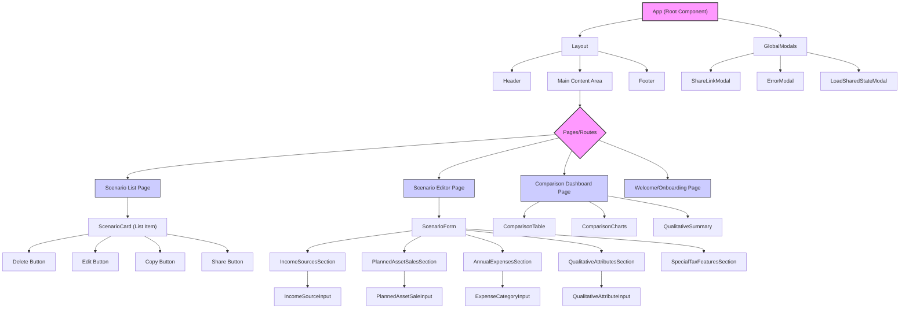

# Tax Scenarios Analyzer MVP: Frontend Architecture Document (Revised)

## 1. Introduction / Purpose

This document details the frontend architecture for the "Tax Scenarios Analyzer MVP." It serves as a technical blueprint for the user interface (UI) development, ensuring consistency, maintainability, scalability, and an optimal user experience. This document complements the main "Tax Scenarios Analyzer MVP Architecture Document" by focusing specifically on client-side implementation details, component design, and interaction patterns.

## 2. Frontend Goals and Objectives

The frontend architecture aims to achieve the following:

* **Intuitive User Experience:** Provide a clear, guided, and easy-to-use interface for defining, comparing, and analyzing tax scenarios.
* **Performance:** Deliver a fast and responsive application, minimizing load times and ensuring smooth interactions.
* **Maintainability:** Structure the codebase in a modular and understandable way to facilitate future development and debugging.
* **Scalability:** Design components and state management to easily accommodate future features and increased complexity.
* **Responsiveness:** Ensure the application is usable and visually appealing across various device sizes (desktop, tablet, mobile).
* **Accessibility (A11y):** Build the UI to be usable by individuals with diverse abilities, leveraging established component libraries.
* **Consistency:** Maintain a unified look, feel, and interaction pattern throughout the application.

## 3. Key Frontend Principles

* **Component-Based Development:** Break down the UI into small, reusable, and self-contained components.
* **Separation of Concerns:** Clearly delineate responsibilities between UI rendering, business logic (calculations), and state management.
* **Single Source of Truth:** Centralize application state to avoid inconsistencies and make data flow predictable.
* **Performance First:** Prioritize optimizations like lazy loading, memoization, and efficient rendering.
* **User Feedback:** Provide immediate and clear feedback for user actions, loading states, and errors.
* **Type Safety:** Leverage TypeScript extensively for robust and predictable code.
* **Accessibility by Design:** Prefer using battle-tested UI components that inherently prioritize accessibility.

## 4. Frontend Technology Stack

The following technologies, confirmed in the overall architecture, form the foundation of the frontend:

* **Language:** **TypeScript** (for type safety and improved developer experience).
* **Framework:** **React** (for declarative UI development and a rich component ecosystem).
* **Build Tool:** **Vite** (for fast development and optimized production builds).
* **Styling:** **Tailwind CSS** (for utility-first CSS, enabling rapid and consistent UI development).
* **UI Components:** **ShadCN UI components** will be used as much as possible for common UI elements (buttons, inputs, cards, dialogs, forms, etc.), leveraging their built-in accessibility and high quality. Custom components will only be developed when a suitable ShadCN component is unavailable or requires significant deviation.
* **State Management:** **React's Context API and `useState`/`useReducer` Hooks** for local and component-specific state, with **Zustand** as a lightweight, performant, and flexible library for global application state (`UserAppState` and `AppCalculatedState`).
* **Routing:** **React Router DOM** (for client-side navigation).
* **Data Compression (for sharing):** **LZ-String** (for URL-based scenario sharing).

## 5. Application Structure and Component Hierarchy

The application will follow a modular, component-driven architecture.

* **`App.tsx` (Root):** Initializes global context providers (e.g., `AppConfigProvider`, `AppStoreProvider`), sets up routing.
* **`Layout`:** Contains common UI elements like `Header`, `Footer`, and the main content area for routed pages.
* **Pages (`src/pages/`):** Top-level components corresponding to different routes (e.g., `ScenarioListPage`, `ScenarioEditorPage`, `ComparisonDashboardPage`). These orchestrate data from the global state and pass it down to presentational components. They will primarily compose ShadCN components.
* **Containers/Smart Components (`src/components/containers/`):** Components that connect to the global state (Zustand store), fetch data, and handle complex logic. They pass data and callbacks to Presentational Components. Examples: `ScenarioListContainer`, `ScenarioEditorContainer`. These will utilize and wrap ShadCN components where logical to form larger, feature-specific UI blocks.
* **Presentational/Dumb Components (`src/components/ui/` or `src/components/shared/`):** Pure UI components that receive all data and callbacks via props. They have no direct knowledge of the application's global state. **This layer will predominantly consist of ShadCN UI components directly, or light wrappers around them to apply specific styling or common prop patterns.** Custom components will only exist here if no ShadCN equivalent is suitable. Examples: `Button`, `Input`, `Card`, `Table` (all from ShadCN).
* **Modals:** Centralized management for various pop-up dialogues, utilizing ShadCN's Dialog component.

## 6. State Management

The application will employ a hybrid state management strategy:

* **Global Application State (`AppStore` via Zustand):**
    * **`UserAppState`:** The main persistent data (all `Assets`, all `Scenarios`). This will be stored in a Zustand store. Zustand's simple API and direct state access are ideal for global mutable state like `UserAppState`.
    * **`AppCalculatedState`:** The non-persistent results of calculations (`resultsByScenario`). Also managed by Zustand, this state will be updated after each calculation run.
    * **`AppConfig`:** The static configuration (tax rates, defaults) will be loaded once and potentially held in a React Context for easy access throughout the component tree without prop drilling.
    * **Persistence Middleware:** Zustand's middleware or a custom effect will be used to automatically save `UserAppState` to `localStorage` on changes.
* **Component Local State (`useState`, `useReducer`):** For UI-specific state that doesn't need to be global or persisted (e.g., form input values before submission, modal open/close status, temporary loading indicators, UI animations).
* **Derived State:** Calculations of values based on existing state should be done in memoized selectors or `useMemo` hooks to prevent unnecessary re-renders.

**Data Flow Example (Scenario Editing):**

1.  User modifies an input field in `ScenarioEditorPage` (using a ShadCN `Input` component, managing its value via local component state).
2.  On blur or form submission, the local state is committed via a callback to the `ScenarioEditorContainer`.
3.  The `ScenarioEditorContainer` dispatches an action to the Zustand `AppStore` to update the relevant `Scenario` object within `UserAppState`.
4.  The `AppStore` update triggers re-renders in components consuming the updated `Scenario` data (e.g., the editor itself, or a dashboard component if visible).
5.  After the `UserAppState` update, a re-calculation is triggered, updating `AppCalculatedState`, which then re-renders results components.

## 7. Data Flow within Frontend

The frontend data flow will largely follow the "unidirectional data flow" principle.

* **Input Data:**
    * `AppConfig` is loaded once at startup and made available via Context.
    * `UserAppState` is loaded from `localStorage` (or URL param) into the Zustand global store.
* **User Interaction:**
    * UI components (predominantly ShadCN) capture user input.
    * Input changes are typically managed by component local state initially.
    * On confirmation (e.g., form submission, blur), local state is dispatched as actions to update the global `UserAppState` in the Zustand store.
* **Calculation Trigger:** Changes to `UserAppState` in the Zustand store (or an explicit user action) will trigger the `Calculation Engine` to process the updated scenarios.
* **Calculated Results:** The `Calculation Engine`'s output (`ScenarioResults`) is stored in the global `AppCalculatedState` within the Zustand store.
* **Rendering:** UI components subscribe to relevant parts of the `AppStore` (or receive props from containers that subscribe) and re-render only when their consumed data changes.

## 8. Routing Strategy

**React Router DOM** will be used for client-side routing.

* **Browser History API:** Utilizes the browser's History API for clean URLs without full page reloads.
* **Routes:**
    * `/`: Welcome/Landing page.
    * `/scenarios`: List of all user-defined scenarios.
    * `/scenario/:id`: Editor for a specific scenario (`:id` being the `Scenario.id`).
    * `/compare`: Comparison dashboard for selected scenarios.
    * `/share`: Route for processing shared URLs (internally redirects after state processing).
    * `*`: 404 Not Found page.
* **Nested Routing:** Use nested routes where appropriate for more complex UI sections.
* **Protected Routes (N/A for MVP):** No authentication needed for MVP, so no protected routes.
* **Dynamic Loading:** Leverage React's `lazy` and `Suspense` for code-splitting routes, improving initial load performance.

## 9. Styling Strategy

**Tailwind CSS** will be the primary styling framework, heavily complemented by **ShadCN UI's** component styling.

* **Utility-First Approach:** Directly apply Tailwind utility classes in JSX for rapid prototyping and consistent styling.
* **ShadCN Theming:** ShadCN components are built on top of Tailwind CSS, making them highly customizable via `tailwind.config.js`. This allows for a unified design system by configuring colors, fonts, spacing, and other design tokens through Tailwind.
* **Component-Level Styling:** For specific customizations of ShadCN components, use the `className` prop to apply Tailwind classes, or create custom CSS (e.g., using `@apply`) if extensive theming or complex variants are needed beyond what ShadCN provides.
* **Atomic Design Principles:** Apply Tailwind classes at the component level, adhering to principles of building from atoms (e.g., ShadCN `Button`, `Input`) to molecules (e.g., ShadCN `Form`) and organisms (e.g., full sections/pages).

## 10. Error Handling (Frontend Specific)

Building upon the overall error handling strategy, the frontend will focus on user-facing error presentation, leveraging ShadCN components.

* **Input Validation Feedback:** Immediate, inline error messages for invalid user input, often integrated with ShadCN's `Form` component patterns.
* **React Error Boundaries:** Implement React Error Boundaries at strategic points in the component tree (e.g., around major page sections or complex widgets) to catch rendering errors and display a fallback UI instead of crashing the entire application.
* **Global Error Notifications:** Use a global notification system, potentially leveraging ShadCN's `Toast` component, for non-critical errors (e.g., `localStorage` save failures, minor data inconsistencies).
* **Modal Dialogs for Critical Errors:** For unrecoverable errors (e.g., major calculation engine failure, critical data loading issues from URL), display a clear, dismissible modal dialog using ShadCN's `Dialog` component, informing the user and advising next steps.
* **User Guidance:** Provide clear, actionable advice to the user when an error occurs, avoiding technical jargon.

## 11. Performance Considerations

Frontend performance is crucial for a smooth user experience.

* **Code Splitting:** Lazy-load routes and potentially large component libraries using `React.lazy()` and `Suspense`.
* **Bundle Size Optimization:** Vite's build process will handle minification and tree-shaking. Regularly review bundle size.
* **Memoization:** Use `React.memo()`, `useMemo()`, and `useCallback()` to prevent unnecessary re-renders of components and recalculations of expensive values.
* **Efficient State Updates:** Design state updates to be granular, only re-rendering affected components.

## 12. Accessibility (A11y) Considerations

Accessibility is a core principle, significantly supported by the choice of ShadCN UI.

* **ShadCN's Accessibility Focus:** A primary reason for choosing ShadCN is its strong focus on accessibility. Components are built using Radix UI primitives, which are designed from the ground up for accessibility (keyboard navigation, ARIA attributes, focus management).
* **Semantic HTML:** Wherever custom components are necessary or when composing ShadCN components, adhere to appropriate HTML5 semantic elements.
* **Keyboard Navigation:** All interactive elements will inherently support keyboard navigation due to ShadCN's foundation. Custom interactions will be thoroughly tested for keyboard operability.
* **Color Contrast:** Adhere to WCAG guidelines for color contrast ratios for any custom styling or themes.
* **Form Labels and Validation:** Leverage ShadCN's `Form` components which handle accessible labeling and error messaging.

## 13. Testing Strategy

A multi-layered testing strategy will ensure frontend quality.

* **Unit Tests (Jest/Vitest & React Testing Library):**
    * Test custom React components in isolation.
    * Test hooks, utility functions, and state management logic.
    * ShadCN components are generally assumed to be well-tested by their maintainers; focus will be on their correct integration and custom logic built around them.
* **Integration Tests (React Testing Library):**
    * Test the interaction between multiple components or a component with its connected store.
    * Simulate user flows through parts of the application (e.g., a form submission and subsequent UI update).
    * Verify that composed components render correctly when connected to the global state.
* **End-to-End (E2E) Tests (Cypress/Playwright - Future):**
    * For future phases, consider E2E testing to simulate full user journeys through the deployed application in a real browser environment. This would cover routing, data persistence, and full UI interactions.

## 14. Internationalization/Localization (I18n/L10n) (Future)

While not part of the MVP, the architecture should allow for future I18n/L10n:

* **Text Strings:** All user-facing text will be externalized (e.g., into JSON files) and loaded dynamically.
* **Libraries:** Integration with a library like `react-i18next` would facilitate translation management.
* **Date/Number Formatting:** Use `Intl.DateTimeFormat` and `Intl.NumberFormat` for locale-aware formatting.

## 15. Developer Experience (DX)

* **Linting (ESLint) & Formatting (Prettier):** Enforce consistent code style and and identify potential issues early.
* **Editor Integration:** Provide recommended VSCode extensions for seamless development.
* **Clear Documentation:** Maintain clear inline code comments and markdown documentation for complex components or patterns.
* **Fast Refresh:** Vite's Hot Module Replacement (HMR) provides instant feedback during development.
* **Type Safety:** Leverage TypeScript throughout the codebase to catch errors at compile time.
* **ShadCN Documentation:** Leverage ShadCN's excellent documentation and examples for component usage.
