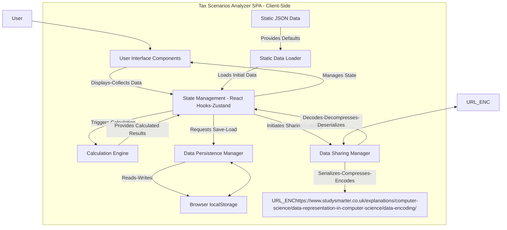
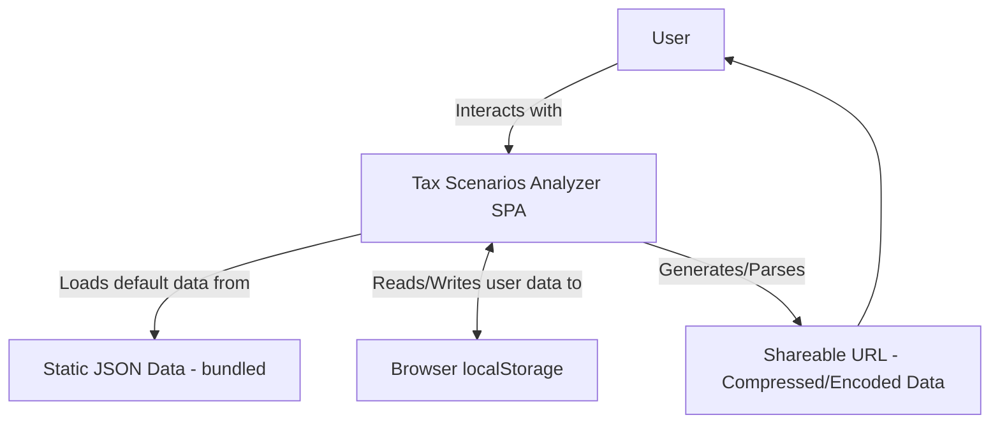
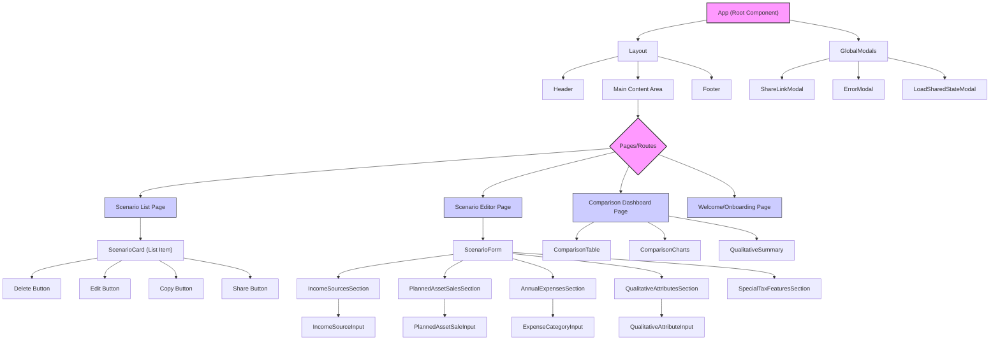
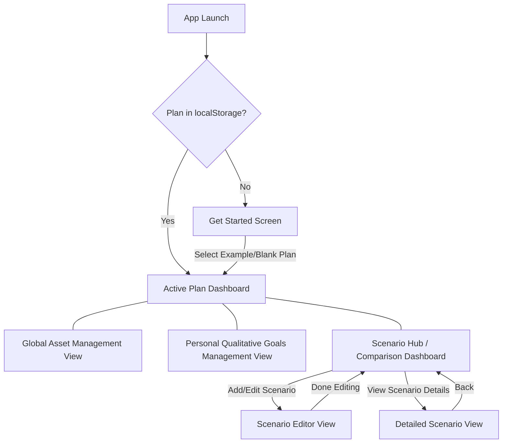
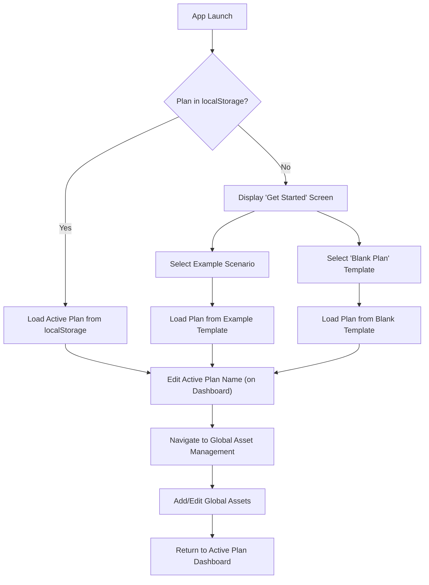
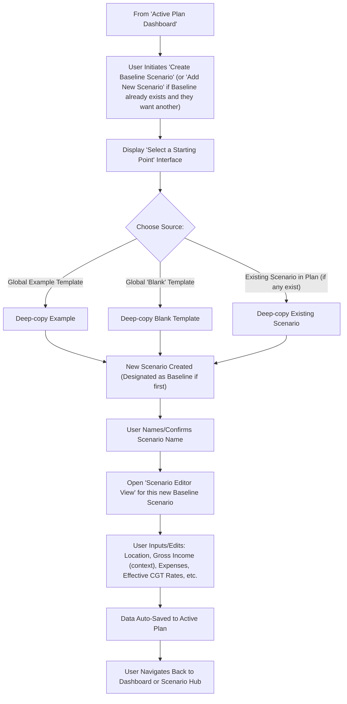
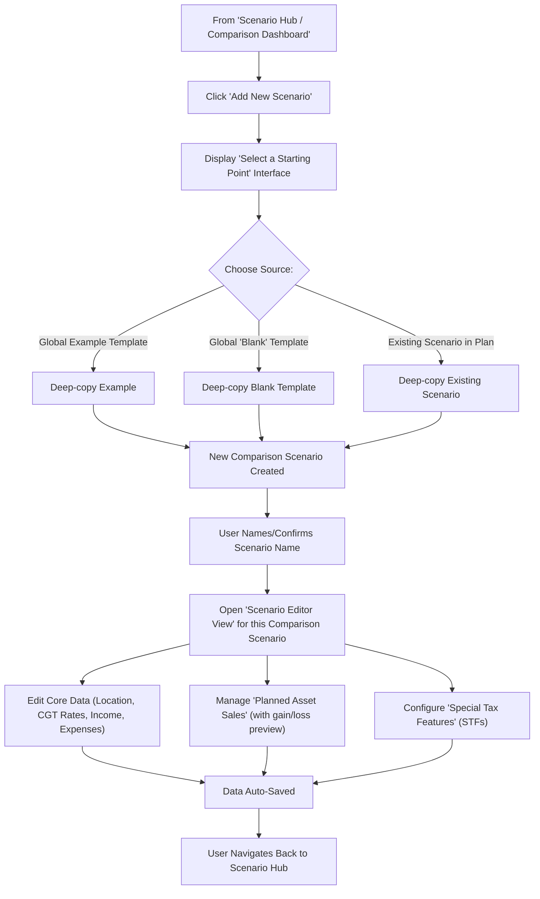
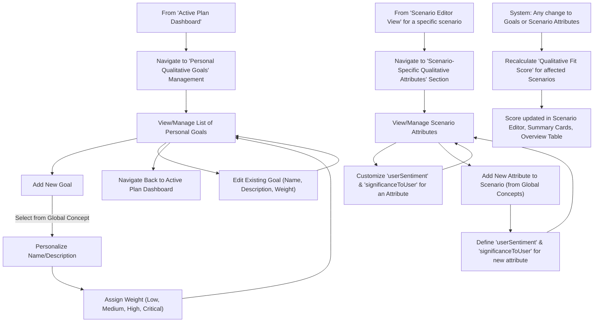
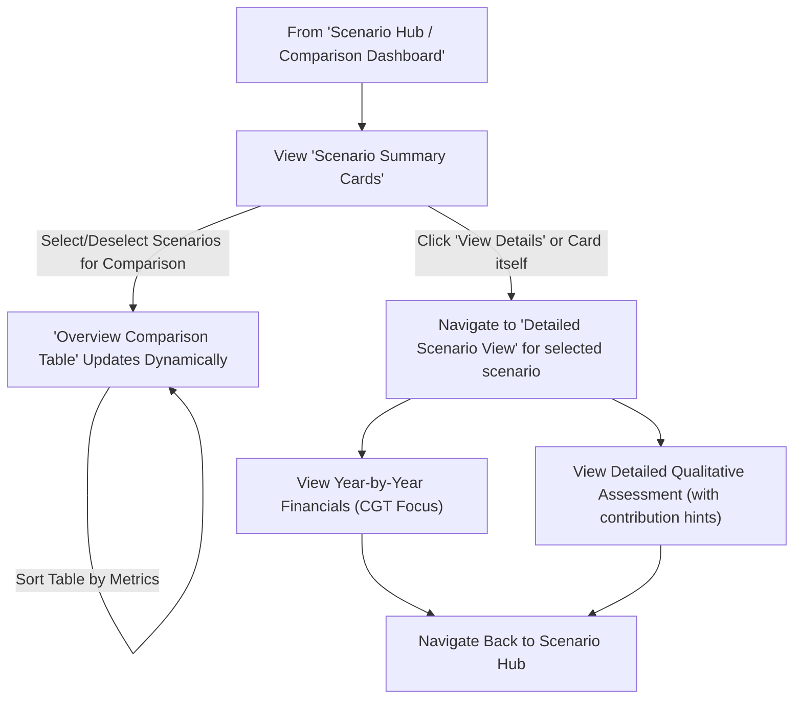
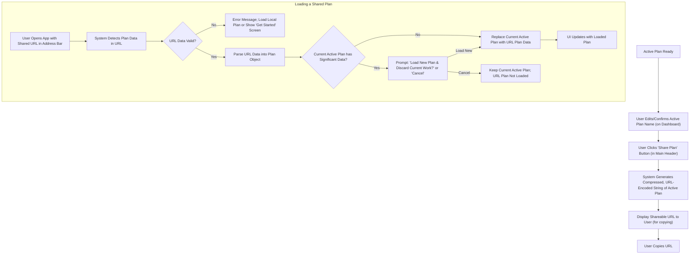

```mermaid
graph TD
    subgraph "Tax Scenarios Analyzer SPA - Client-Side"
        UI[User Interface Components]
        SM[State Management - React Hooks-Zustand]
        CE[Calculation Engine]
        DPM[Data Persistence Manager]
        DSM[Data Sharing Manager]
        SDL[Static Data Loader]

        UI -- Displays-Collects Data --> SM
        SM -- Manages State --> UI
        SM -- Triggers Calculation --> CE
        CE -- Provides Calculated Results --> SM
        SM -- Requests Save-Load --> DPM
        DPM -- Reads-Writes --> BLS[Browser localStorage]
        SM -- Initiates Sharing-Loading --> DSM
        DSM -- Serializes-Compresses-Encodes --> URL_ENChttps://www.studysmarter.co.uk/explanations/computer-science/data-representation-in-computer-science/data-encoding/
        DSM -- Decodes-Decompresses-Deserializes --> SM
        SDL -- Loads Initial Data --> SM
        StaticJSON[Static JSON Data] -- Provides Defaults --> SDL
    end

    User --> UI
    BLS <--> DPM
    URL_ENC <--> DSM
```

```mermaid
graph TD
    A[User] -->|Interacts with| B[Tax Scenarios Analyzer SPA]

    B -->|Loads default data from| C[Static JSON Data - bundled]
    B <-->|Reads/Writes user data to| D[Browser localStorage]
    B -->|Generates/Parses| E[Shareable URL - Compressed/Encoded Data]
    E --> A
```

```mermaid
graph TD
    A["App (Root Component)"] --> B[Layout]
    B --> C[Header]
    B --> D[Main Content Area]
    B --> E[Footer]

    D --> F{"Pages/Routes"}
    F --> G[Scenario List Page]
    F --> H[Scenario Editor Page]
    F --> I[Comparison Dashboard Page]
    F --> J[Welcome/Onboarding Page]

    G --> K["ScenarioCard (List Item)"]
    K --> L[Delete Button]
    K --> M[Edit Button]
    K --> N[Copy Button]
    K --> O[Share Button]

    H --> P[ScenarioForm]
    P --> Q[IncomeSourcesSection]
    P --> R[PlannedAssetSalesSection]
    P --> S[AnnualExpensesSection]
    P --> T[QualitativeAttributesSection]
    P --> U[SpecialTaxFeaturesSection]
    Q --> V[IncomeSourceInput]
    R --> W[PlannedAssetSaleInput]
    S --> X[ExpenseCategoryInput]
    T --> Y[QualitativeAttributeInput]

    I --> Z[ComparisonTable]
    I --> AA[ComparisonCharts]
    I --> BB[QualitativeSummary]

    A --> CC[GlobalModals]
    CC --> DD[ShareLinkModal]
    CC --> EE[ErrorModal]
    CC --> FF[LoadSharedStateModal]

    style A fill:#f9f,stroke:#333,stroke-width:2px
    style F fill:#f9f,stroke:#333,stroke-width:2px
    style G fill:#ccf,stroke:#333,stroke-width:1px
    style H fill:#ccf,stroke:#333,stroke-width:1px
    style I fill:#ccf,stroke:#333,stroke-width:1px
    style J fill:#ccf,stroke:#333,stroke-width1px
```

```mermaid
graph TD
    A["App Launch"] --> B{"Plan in localStorage?"};
    B -- No --> C["Get Started Screen"];
    B -- Yes --> D["Active Plan Dashboard"];
    C -- "Select Example/Blank Plan" --> D;
    D --- E["Global Asset Management View"];
    D --- F["Personal Qualitative Goals Management View"];
    D --- G["Scenario Hub / Comparison Dashboard"];
    G -- "Add/Edit Scenario" --> H["Scenario Editor View"];
    G -- "View Scenario Details" --> I["Detailed Scenario View"];
    H -- "Done Editing" --> G;
    I -- "Back" --> G;
```

```mermaid
graph TD
    A[App Launch] --> B{Plan in localStorage?};
    B -- Yes --> C[Load Active Plan from localStorage];
    C --> F["Edit Active Plan Name (on Dashboard)"];
    B -- No --> D["Display 'Get Started' Screen"];
    D --> E1["Select Example Scenario"];
    D --> E2["Select 'Blank Plan' Template"];
    E1 --> C2[Load Plan from Example Template];
    E2 --> C3[Load Plan from Blank Template];
    C2 --> F;
    C3 --> F;
    F --> G[Navigate to Global Asset Management];
    G --> H[Add/Edit Global Assets];
    H --> D2["Return to Active Plan Dashboard"];
```

```mermaid
graph TD
    A["From 'Active Plan Dashboard'"] --> B["User Initiates 'Create Baseline Scenario' (or 'Add New Scenario' if Baseline already exists and they want another)"];
    B --> C["Display 'Select a Starting Point' Interface"];
    C --> D{"Choose Source:"};
    D -- "Global Example Template" --> E[Deep-copy Example];
    D -- "Global 'Blank' Template" --> F[Deep-copy Blank Template];
    D -- "Existing Scenario in Plan (if any exist)" --> G[Deep-copy Existing Scenario];
    E --> H["New Scenario Created (Designated as Baseline if first)"];
    F --> H;
    G --> H;
    H --> I["User Names/Confirms Scenario Name"];
    I --> J["Open 'Scenario Editor View' for this new Baseline Scenario"];
    J --> K["User Inputs/Edits: Location, Gross Income (context), Expenses, Effective CGT Rates, etc."];
    K --> L["Data Auto-Saved to Active Plan"];
    L --> M["User Navigates Back to Dashboard or Scenario Hub"];
```

---

```mermaid
graph TD
    A["From 'Scenario Hub / Comparison Dashboard'"] --> B["Click 'Add New Scenario'"];
    B --> C["Display 'Select a Starting Point' Interface"];
    C --> D{"Choose Source:"};
    D -- "Global Example Template" --> E[Deep-copy Example];
    D -- "Global 'Blank' Template" --> F[Deep-copy Blank Template];
    D -- "Existing Scenario in Plan" --> G[Deep-copy Existing Scenario];
    E --> H["New Comparison Scenario Created"];
    F --> H;
    G --> H;
    H --> I["User Names/Confirms Scenario Name"];
    I --> J["Open 'Scenario Editor View' for this Comparison Scenario"];
    J --> K["Edit Core Data (Location, CGT Rates, Income, Expenses)"];
    J --> L["Manage 'Planned Asset Sales' (with gain/loss preview)"];
    J --> M["Configure 'Special Tax Features' (STFs)"];
    K --> N["Data Auto-Saved"];
    L --> N;
    M --> N;
    N --> O["User Navigates Back to Scenario Hub"];
```

---

```mermaid
graph TD
    A["From 'Active Plan Dashboard'"] --> B["Navigate to 'Personal Qualitative Goals' Management"];
    B --> C["View/Manage List of Personal Goals"];
    C --> D["Add New Goal"];
    D -- Select from Global Concept --> E["Personalize Name/Description"];
    E --> F["Assign Weight (Low, Medium, High, Critical)"];
    F --> C;
    C --> G["Edit Existing Goal (Name, Description, Weight)"];
    G --> C;
    C --> H["Navigate Back to Active Plan Dashboard"];

    H2["From 'Scenario Editor View'" for a specific scenario] --> I["Navigate to 'Scenario-Specific Qualitative Attributes' Section"];
    I --> J["View/Manage Scenario Attributes"];
    J --> K["Customize 'userSentiment' & 'significanceToUser' for an Attribute"];
    K --> J;
    J --> L["Add New Attribute to Scenario (from Global Concepts)"];
    L --> M["Define 'userSentiment' & 'significanceToUser' for new attribute"];
    M --> J;

    N[System: Any change to Goals or Scenario Attributes] --> O["Recalculate 'Qualitative Fit Score' for affected Scenarios"];
    O --> P["Score updated in Scenario Editor, Summary Cards, Overview Table"];
```

---

```mermaid
graph TD
    A["From 'Scenario Hub / Comparison Dashboard'"] --> B["View 'Scenario Summary Cards'"];
    B -- Select/Deselect Scenarios for Comparison --> C["'Overview Comparison Table' Updates Dynamically"];
    C -- Sort Table by Metrics --> C;
    B -- Click 'View Details' or Card itself --> D["Navigate to 'Detailed Scenario View' for selected scenario"];
    D --> E["View Year-by-Year Financials (CGT Focus)"];
    D --> F["View Detailed Qualitative Assessment (with contribution hints)"];
    E --> G["Navigate Back to Scenario Hub"];
    F --> G;
```

---

```mermaid
graph TD
    A[Active Plan Ready] --> B["User Edits/Confirms Active Plan Name (on Dashboard)"];
    B --> C["User Clicks 'Share Plan' Button (in Main Header)"];
    C --> D["System Generates Compressed, URL-Encoded String of Active Plan"];
    D --> E["Display Shareable URL to User (for copying)"];
    E --> F[User Copies URL];

    subgraph Loading a Shared Plan
        G[User Opens App with Shared URL in Address Bar] --> H["System Detects Plan Data in URL"];
        H --> I{URL Data Valid?};
        I -- No --> J["Error Message; Load Local Plan or Show 'Get Started' Screen"];
        I -- Yes --> K["Parse URL Data into Plan Object"];
        K --> L{Current Active Plan has Significant Data?};
        L -- Yes --> M["Prompt: 'Load New Plan & Discard Current Work?' or 'Cancel'"];
        M -- "Load New" --> N["Replace Current Active Plan with URL Plan Data"];
        M -- "Cancel" --> O["Keep Current Active Plan; URL Plan Not Loaded"];
        L -- No --> N;
        N --> P["UI Updates with Loaded Plan"];
    end

```
